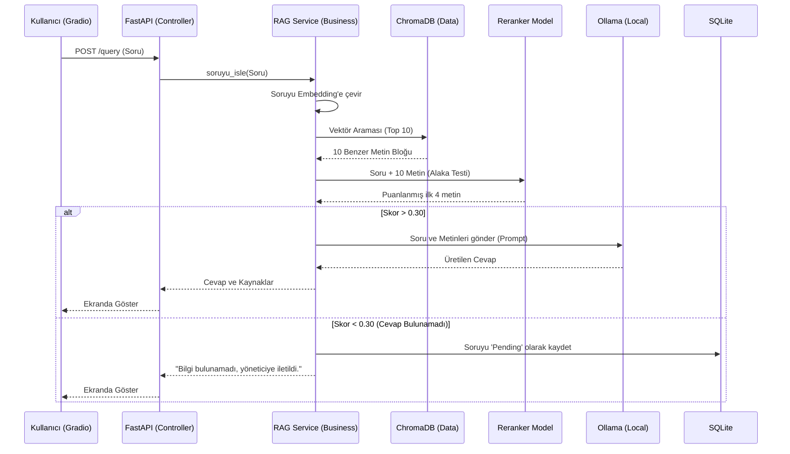

# SoSmart Bilgi Asistanı - Staj 3. Hafta Raporları

Bu belge, stajın 3. haftasında istenen teslimleri (Mimari Açıklama, Veri Akış Diyagramı, Kod İncelemesi ve Teknoloji Raporu) içermektedir.

---

## 1. Proje Mimari Açıklaması

Sistem, sürdürülebilirliği sağlamak amacıyla 3 katmanlı (N-Tier) mimari üzerine inşa edilmiştir:

1. **Presentation / UI Katmanı (Gradio Frontend):** 
   Kullanıcının sistemle iletişim kurduğu katmandır. Kullanıcılar soruları buradan sorar, yöneticiler belgeleri buradan yükler. REST API üzerinden backend'e istek atar.
2. **Controller Katmanı (FastAPI API Router):**
   `app/api/` dizinindeki dosyalardır. Sadece HTTP isteklerini (GET, POST) karşılar. Pydantic şemaları ile doğrulama yapar ve isteği Business katmanına yönlendirir. İçinde mantık (hesaplama) barındırmaz.
3. **Business / Service Katmanı:**
   `app/services/` dizinidir. Yapay zeka ile entegrasyon (RAG Service), vektör veritabanında arama yapma, Re-ranking ile sonuçları eleme ve PDF'leri bölme işlemleri burada yapılır.
4. **Data Access Katmanı (ChromaDB & SQLite):**
   Uygulamanın hafızasıdır. Vektör haline gelmiş cümleler (embeddings) ChromaDB'de tutulurken, ilişkisel veriler (bekleyen sorular, durum bilgileri vb.) SQLite'ta saklanır.

---

## 2. Veri Akış Diyagramı (Data Flow Diagram)

Kullanıcı arayüzden soru sorduğunda arka planda verilerin geçtiği yollar:

---

## 3. Kod Yapısı İncelemesi (Önemli Modüller)

- **`document_parser.py` (Recursive Chunking):** 
  Bu sınıf, sisteme PDF veya DOCX geldiğinde çalışır. `RecursiveCharacterTextSplitter` kullanarak metni ortasından değil; önce paragraflardan, paragraf büyükse cümlelerden böler. Bu sayede LLM bağlamı (context) kaybetmez.
- **`rag_service.py` (Orkestratör):** 
  En kritik dosyadır. Sisteme gelen soruyu alır, `vector_store.search` metoduyla ChromaDB'den benzer yazıları getirir. Ardından `reranker_service` metodunu çağırıp Cross-Encoder ile eleme yaptırır ve kalan metinlerle Ollama'ya Prompt gönderir. Hata yönetimi (try-catch blokları) burada bulunur; veritabanına bağlanılamazsa 500 dönmesini engeller.
- **`auth.py` (Güvenlik Modülü):** 
  Kullanıcı adı ve şifre alındığında `bcrypt` ile şifrenin hash değerini kontrol eder. `jwt.encode` kullanarak içerisine kullanıcı rolünü (admin/user) gömdüğü geçici bir token üretir. Admin yetkisi gereken metotlarda `@Depends(require_admin)` kuralını çalıştırır.

---

## 4. Kullanılan Teknolojiler Hakkında Rapor

| Teknoloji | Tür | Kullanım Amacı ve Nedeni |
| :--- | :--- | :--- |
| **Ollama** | LLM Engine | Verilerin şirket dışına çıkmasını engellemek için yerel bir çözüm sunar. Qwen2.5:3b modeli hafif olduğu için CPU ve orta halli GPU'larda sorunsuz çalışır. |
| **FastAPI** | Backend Framework | Python ekosistemindeki en modern ve hızlı web servis yapısıdır. Asenkron (async) desteği sayesinde LLM'i beklerken sunucu kilitlenmez. |
| **Gradio** | Frontend UI | Makine öğrenmesi projelerinde hızlıca arayüz (Chatbot, Dashboard) kurmak için en iyi kütüphanedir. HTML/JS yazma gereksinimini ortadan kaldırır. |
| **ChromaDB** | Vektör DB | Geleneksel veritabanları (SQL) metinleri "anlamsal" (semantik) olarak arayamaz. ChromaDB metinleri sayısal haritalara döker ve anlamca birbirine yakın kelimeleri bulur. |
| **Sentence-Transformers** | Embedding | Metinleri vektörlere dönüştürür. Türkçe desteği güçlü olan çok dilli (multilingual) bir model tercih edilmiştir. |
| **Docker** | Containerization | Yazılımın başka bir bilgisayarda (örneğin hocanın bilgisayarında) "bende çalışmıyor" hatası vermesini engeller. Tüm sistemi izole bir kutuya koyar. |
